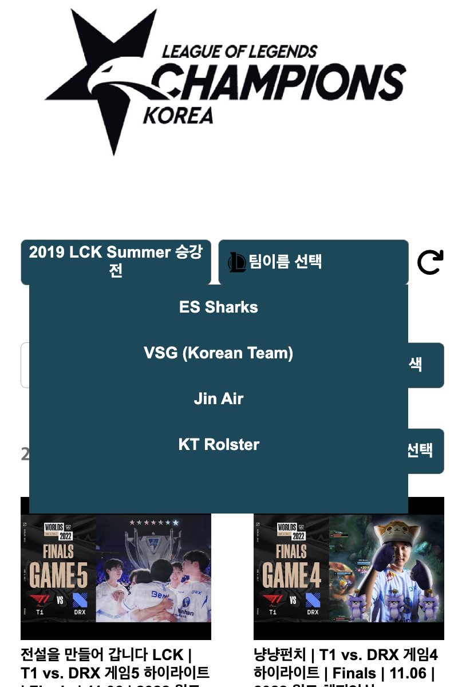

# 프로젝트 개요

### LCK 유튜브엔 LOL 대회 하이라이트가 있다.

```
LCK 를 좋아하는 사람들은 시청하기 선호하는 시즌/팀 이 있다.

가령, 명경기였던 2021 스프링 / GenG vs T1 가 있었다면, 해당 경기의 하이라이트 모음만 챙겨 보고 싶어 한다.

하지만 유튜브 자체 필터 기능으론 '팀 별' 'LCK 시즌 별' 로 필터링할 수 없다.

그리하여 우리는 LCK 유튜브 채널의 하이라이트 영상을 '필터링' 해 모아 볼 수 있는 서비스를 만들었다.
```

<br/>

# 주요 기능

## 필터

| LCK 시즌 필터                          | 팀 필터                              | 승패 필터 및 정렬                        |
| -------------------------------------- | ------------------------------------ | ---------------------------------------- |
|  |  |  |

<br/>

## 동영상

| 동영상 상단 Sticky              | 무한 페이징 스크롤                      | 현 동영상 종료 시 다음 동영상 자동재생 |
| ------------------------------- | --------------------------------------- | -------------------------------------- |
|  |  |  |

# 개발 특이사항

## modal

```
modal
 ㄴ 시즌 선택모달
 ㄴ 팀 선택 모달
 ㄴ 정렬 모달

 위 세 모달이 존재한다.

 모달 open 은 atomic 해야 하므로 하나의 모달을 open 하면 타 모달은 close 처리한다.

 openAtomicModalName 이라는 전역 state 를 통해 해당 기능을 구현했으며

 모달 관련 기능은 세 컴포넌트에 공통으로 필요하기에 ./src/composables/atomicModal.js 에 기능을 정의하고
 각 컴포넌트에서 setup hook 을 통해 compositioin API 로써 사용했다.
```

## 유튜브 동영상 iframe

```
동영상 play 는 유튜브 iframe 을 이용한다.

자동재생과 같이 iframe 내부 요소의 event 를 직접 listen 해야 하는 경우가 있다.

이는 vue3-youtube 패키지를 이용해 간단히 구현할 수 있었다.
```

## 무한 페이징

```
동영상 리스트 요소에 스크롤/마우스 휠링 event 발생 시 '화면의 최하단' 에 도달 했는지 측정하고,

도달 했다면 동영상 리스트를 추가로 쿼리한다.
```

## 반응형

```
디자인은 Mobile 위주이며,
PC 이용자를 고려해 반응형으로 제작했다. (media-query)
```

## 스타일

```
css 는 개발 편의성을 위해 css 스타일링을 계층적으로 코딩할 수 있는 scss 를 이용했으며

./src/assets/scss/global.scss

에 공통 사용 색상 및 size, padding 등을 변수로 선언해 css 유지보수가 편리하도록 함
```

<hr/>
<br/>

# 앱 빌드 및 배포

```
1. npm install
2. npm run serve // 로컬 dev
3. npm run build // App 빌드(경로 : root경로의 ./dist)
4. firebase deploy // ./dist 경로의 App 빌드 결과물을 firebase 서버에 배포

c.f.) https://lck-ventory.donnie4567.com/ 에 배포
```
